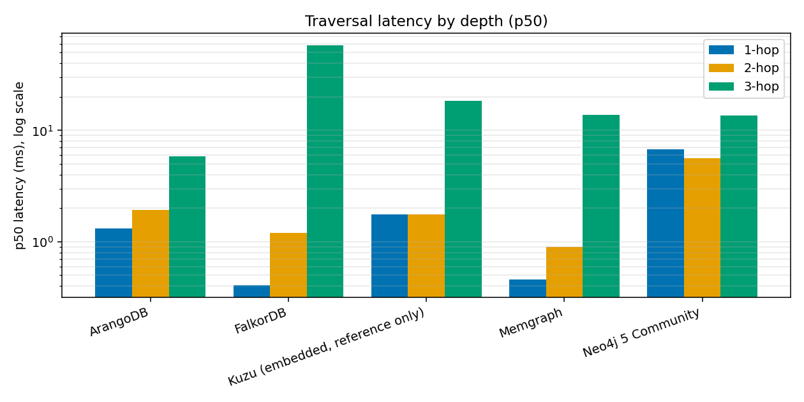
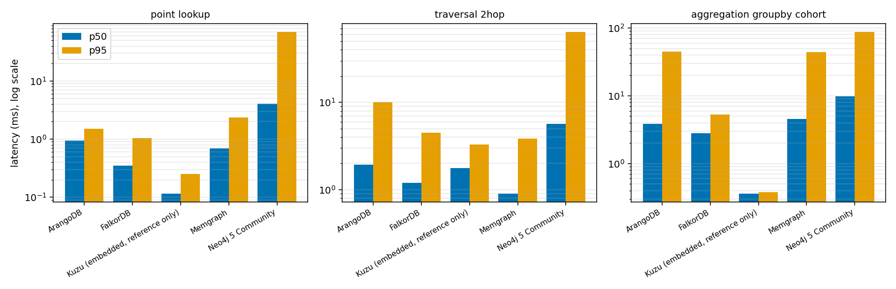
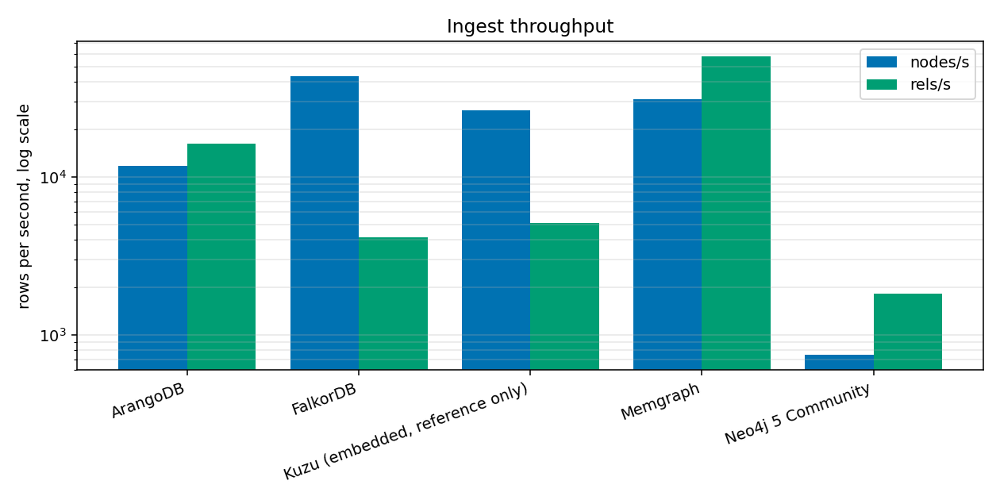
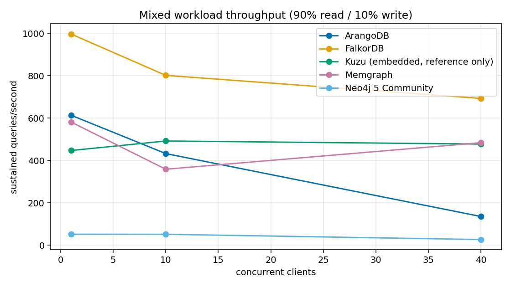

# Results

Generated from `results/20260824T093849Z/` by `graphbench report`. Do not edit by hand.

## Run

- Run id: `20260824T093849Z`, started 2026-08-24T09:38:49+00:00, finished 2026-08-24T09:56:17+00:00
- Dataset: **ca-astroph**, 18,771 nodes / 198,050 relationships, sha256 `51bf1e2cace269b8...`
- Degree: min 1, mean 21.102, max 504. Start nodes: 256 from degree band [5, 50], seed 7919
- Source: https://snap.stanford.edu/data/ca-AstroPh.txt.gz
- Client: Darwin 25.5.0 / arm64, 8 cores, 9 GB RAM, Python 3.13.15
- Drivers: neo4j 5.28.4, FalkorDB 1.7.1, python-arango 8.3.3, kuzu 0.11.3
- Code: commit `54ef12c5f176` (working tree dirty)
- Workload: 100 measured iterations after 20 warm-up, batch size 1000, per-query ceiling 30s
- Mixed: 90% read at [1, 10, 40] clients for 30s each

## Verification

All platforms returned identical values on **404** checked query results. Same input, same answer, so the latency comparison is between equivalent queries.

## Platforms and tiers

| Platform | Track | Engine | Version | vCPU | RAM | Disk | Tier source |
| --- | --- | --- | --- | ---: | ---: | ---: | --- |
| ArangoDB (capped) | local | arangodb | ArangoDB 3.12.10-1 | 0.5 | 256 MB | 1 GB | docker-compose.yml |
| FalkorDB (capped) | local | falkordb | FalkorDB module 4.20.4 on Redis 8.6.3 | 0.5 | 256 MB | 1 GB | docker-compose.yml |
| Kuzu (embedded, reference only) | reference | kuzu | Kuzu 0.11.3 (embedded, in-process) | - | 256 MB | 1 GB | graphbench/adapters/kuzu.py |
| Memgraph (capped) | local | memgraph | Memgraph 3.12.0 | 0.5 | 256 MB | 1 GB | docker-compose.yml |
| Neo4j 5 Community (capped) | local | neo4j | Neo4j Kernel 5.26.29 (community) | 0.5 | 256 MB | 1 GB | docker-compose.yml |

### Not run

- `cognodb-cloud`: missing COGNODB_URI, COGNODB_PASSWORD
- `neo4j-aura`: missing NEO4J_AURA_URI, NEO4J_AURA_PASSWORD
- `memgraph-cloud`: missing MEMGRAPH_CLOUD_URI, MEMGRAPH_CLOUD_PASSWORD
- `arango-cloud`: missing ARANGO_CLOUD_URL, ARANGO_CLOUD_PASSWORD
- `falkordb-cloud`: missing FALKORDB_CLOUD_HOST, FALKORDB_CLOUD_PASSWORD

A skipped platform means no credentials were configured, not that it failed.

## Resource-matched track (primary)

Every engine in Docker at 0.5 vCPU / 256 MB, CognoDB's free c0 envelope, on one client machine over loopback. This is the only comparison here that can honestly claim resource parity.

### Ingest

| Platform | Nodes/s | Rels/s | Index build (s) | Total load (s) | Rows loaded | Load method |
| --- | ---: | ---: | ---: | ---: | ---: | --- |
| ArangoDB (capped) | 11,673 | 16,242 | 0.18 | 14.0 | 216,821/216,821 | python-arango, AQL batch INSERT (not import_bulk, see module docstring) |
| FalkorDB (capped) | 43,395 | 4,124 | 1.18 | 49.6 | 216,821/216,821 | FalkorDB client over RESP, GRAPH.QUERY with UNWIND batches |
| Memgraph (capped) | 30,923 | 57,767 | 0.21 | 4.3 | 216,821/216,821 | official Neo4j Bolt driver, UNWIND batches |
| Neo4j 5 Community (capped) | 745 | 1,814 | 27.98 | 162.3 | 216,821/216,821 | official Neo4j Bolt driver, UNWIND batches |

### Read latency

| Platform | RETURN 1 | Point | 1-hop | 2-hop | 3-hop | Filtered | Group-by |
| --- | ---: | ---: | ---: | ---: | ---: | ---: | ---: |
| **P50 (ms)** |  |  |  |  |  |  |  |
| ArangoDB (capped) | 0.93 | 0.95 | 1.32 | 1.93 | 5.87 | 0.94 | 3.84 |
| FalkorDB (capped) | 0.25 | 0.35 | 0.41 | 1.20 | 58.05 | 0.84 | 2.80 |
| Memgraph (capped) | 0.32 | 0.69 | 0.46 | 0.90 | 13.88 | 0.63 | 4.59 |
| Neo4j 5 Community (capped) | 2.99 | 4.08 | 6.72 | 5.66 | 13.66 | 3.31 | 9.75 |
| **P95 (ms)** |  |  |  |  |  |  |  |
| ArangoDB (capped) | 2.14 | 1.51 | 5.75 | 10.05 | 62.87 | 1.54 | 45.05 |
| FalkorDB (capped) | 0.54 | 1.04 | 1.29 | 4.49 | 526.41 | 1.40 | 5.32 |
| Memgraph (capped) | 0.69 | 2.38 | 1.76 | 3.86 | 173.55 | 1.14 | 44.52 |
| Neo4j 5 Community (capped) | 73.20 | 70.42 | 187.57 | 64.49 | 271.18 | 72.11 | 88.29 |

A ⚠ marks a workload that was abandoned or had failed iterations. Its percentiles cover only the iterations that completed.

### Engine cost with the network subtracted

Traversal p50 minus the `RETURN 1` p50 on the same platform.

| Platform | RETURN 1 p50 | 1-hop minus baseline | 2-hop minus baseline | 3-hop minus baseline |
| --- | ---: | ---: | ---: | ---: |
| ArangoDB (capped) | 0.93 | 0.39 | 0.99 | 4.94 |
| FalkorDB (capped) | 0.25 | 0.16 | 0.95 | 57.80 |
| Memgraph (capped) | 0.32 | 0.14 | 0.58 | 13.56 |
| Neo4j 5 Community (capped) | 2.99 | 3.73 | 2.66 | 10.66 |

### Mixed workload

| Platform | 1 client (qps) | 10 clients (qps) | 40 clients (qps) | Read p95 @ max | Errors |
| --- | ---: | ---: | ---: | ---: | ---: |
| ArangoDB (capped) | 613.3 | 432.5 | 135.5 | 905.51 | 45 |
| FalkorDB (capped) | 996.6 | 801.7 | 692.8 | 101.28 | 0 |
| Memgraph (capped) | 581.1 | 358.6 | 483.9 | 183.54 | 0 |
| Neo4j 5 Community (capped) | 51.7 | 51.5 | 26.6 | 2402.09 | 2 |

### Footprint

| Platform | Observed RSS | % of cap | Store on disk | Engine-reported | Source |
| --- | ---: | ---: | ---: | --- | --- |
| ArangoDB (capped) | 225.4MiB / 256MiB | 88.04% | 87.8 MB | yes | collection statistics() |
| FalkorDB (capped) | 119.8MiB / 256MiB | 46.78% | - | yes | INFO memory + GRAPH.MEMORY |
| Memgraph (capped) | 145.1MiB / 256MiB | 56.67% | 0.2 MB | yes | SHOW STORAGE INFO |
| Neo4j 5 Community (capped) | 255.8MiB / 256MiB | 99.93% | 542.5 MB | yes | dbms.queryJmx |

### Indexes actually created

**ArangoDB (capped)**
- unique key (persistent) on authors
- composite (cohort, degree) (persistent) on authors
- bench tag (persistent) on bench
- bench edge tag (persistent) on bench_edge
- NOTE: no secondary index on id, edge load uses _key via the primary index

**FalkorDB (capped)**
- key: CREATE INDEX FOR (a:Author) ON (a.key)
- id (edge load path): CREATE INDEX FOR (a:Author) ON (a.id)
- composite (cohort, degree): CREATE INDEX FOR (a:Author) ON (a.cohort, a.degree)
- bench tag (mixed workload cleanup): CREATE INDEX FOR (b:Bench) ON (b.tag)
- NOTE: no unique constraint on key, index only

**Memgraph (capped)**
- unique key: CREATE CONSTRAINT ON (a:Author) ASSERT a.key IS UNIQUE
- key: CREATE INDEX ON :Author(key)
- id (edge load path): CREATE INDEX ON :Author(id)
- cohort (no composite support): CREATE INDEX ON :Author(cohort)
- bench tag (mixed workload cleanup): CREATE INDEX ON :Bench(tag)

**Neo4j 5 Community (capped)**
- unique key: CREATE CONSTRAINT author_key IF NOT EXISTS FOR (a:Author) REQUIRE a.key IS UNIQUE
- id (edge load path): CREATE INDEX author_id IF NOT EXISTS FOR (a:Author) ON (a.id)
- composite (cohort, degree): CREATE INDEX author_cohort_degree IF NOT EXISTS FOR (a:Author) ON (a.cohort, a.degree)
- bench tag (mixed workload cleanup): CREATE INDEX bench_tag IF NOT EXISTS FOR (b:Bench) ON (b.tag)

### Run status

| Platform | Status | Store reset first | Wall clock (s) | Errors |
| --- | --- | --- | ---: | ---: |
| ArangoDB (capped) | ok | yes, volumes wiped | 138 | 0 |
| FalkorDB (capped) | ok | yes, volumes wiped | 169 | 0 |
| Memgraph (capped) | ok | yes, volumes wiped | 119 | 0 |
| Neo4j 5 Community (capped) | ok | yes, volumes wiped | 480 | 0 |

## Embedded reference (not ranked)

In-process, so there is no network round trip at all. Included as a floor: the gap between this and the Bolt engines is protocol and network cost rather than graph engine cost.

### Ingest

| Platform | Nodes/s | Rels/s | Index build (s) | Total load (s) | Rows loaded | Load method |
| --- | ---: | ---: | ---: | ---: | ---: | --- |
| Kuzu (embedded, reference only) | 26,361 | 5,124 | 0.10 | 39.5 | 216,821/216,821 | embedded kuzu, in-process Cypher UNWIND batches |

### Read latency

| Platform | RETURN 1 | Point | 1-hop | 2-hop | 3-hop | Filtered | Group-by |
| --- | ---: | ---: | ---: | ---: | ---: | ---: | ---: |
| **P50 (ms)** |  |  |  |  |  |  |  |
| Kuzu (embedded, reference only) | 0.04 | 0.12 | 1.76 | 1.76 | 18.51 | 0.23 | 0.36 |
| **P95 (ms)** |  |  |  |  |  |  |  |
| Kuzu (embedded, reference only) | 0.05 | 0.25 | 3.43 | 3.28 | 241.95 | 0.25 | 0.38 |

A ⚠ marks a workload that was abandoned or had failed iterations. Its percentiles cover only the iterations that completed.

### Engine cost with the network subtracted

Traversal p50 minus the `RETURN 1` p50 on the same platform.

| Platform | RETURN 1 p50 | 1-hop minus baseline | 2-hop minus baseline | 3-hop minus baseline |
| --- | ---: | ---: | ---: | ---: |
| Kuzu (embedded, reference only) | 0.04 | 1.72 | 1.72 | 18.47 |

### Mixed workload

| Platform | 1 client (qps) | 10 clients (qps) | 40 clients (qps) | Read p95 @ max | Errors |
| --- | ---: | ---: | ---: | ---: | ---: |
| Kuzu (embedded, reference only) | 447.1 | 491.9 | 477.4 | 235.82 | 50 |

### Footprint

| Platform | Observed RSS | % of cap | Store on disk | Engine-reported | Source |
| --- | ---: | ---: | ---: | --- | --- |
| Kuzu (embedded, reference only) | not observable | - | 9.3 MB | yes | store file size |

### Indexes actually created

**Kuzu (embedded, reference only)**
- node table with primary key on key: CREATE NODE TABLE Author(id INT64, key STRING, cohort INT64, degree INT64, PRIMARY KEY(key))
- relationship table: CREATE REL TABLE Coauthor(FROM Author TO Author)
- bench node table (mixed workload): CREATE NODE TABLE Bench(key STRING, tag STRING, PRIMARY KEY(key))
- bench rel table (mixed workload): CREATE REL TABLE BenchEdge(FROM Author TO Bench)
- NOTE: only the primary key is indexed, id lookups are scans

### Run status

| Platform | Status | Store reset first | Wall clock (s) | Errors |
| --- | --- | --- | ---: | ---: |
| Kuzu (embedded, reference only) | ok | not a local container platform | 142 | 0 |

## Charts

## Errors

No platform reported an error on this run.

## Reading these numbers

- Percentiles are nearest-rank over the raw samples, which are kept in the results JSON so any of this can be recomputed or plotted differently.
- Latency is measured client-side and includes driver and protocol cost. The `RETURN 1` column is that cost with no graph work in it.
- `cpus: 0.5` on the local track is a CFS quota, a hard ceiling every period. CognoDB's 0.5 vCPU is burstable and can exceed baseline while it has credit, so tail latency is not directly comparable across tracks.
- Two runs of identical configuration disagree by 60-360% on ingest and saturated throughput while agreeing within 6% on `RETURN 1`. Which metrics survive repetition is in [VARIANCE.md](VARIANCE.md), and any difference smaller than the spread there is not a finding.
- Interpretation, mechanisms and known gaps: [ANALYSIS.md](ANALYSIS.md).
- Every judgement call, and what this suite does not measure: [DECISIONS.md](DECISIONS.md).

